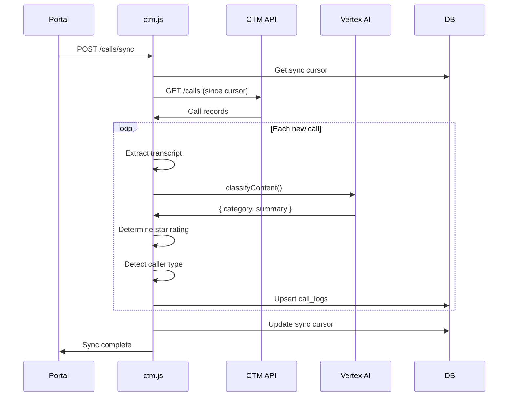
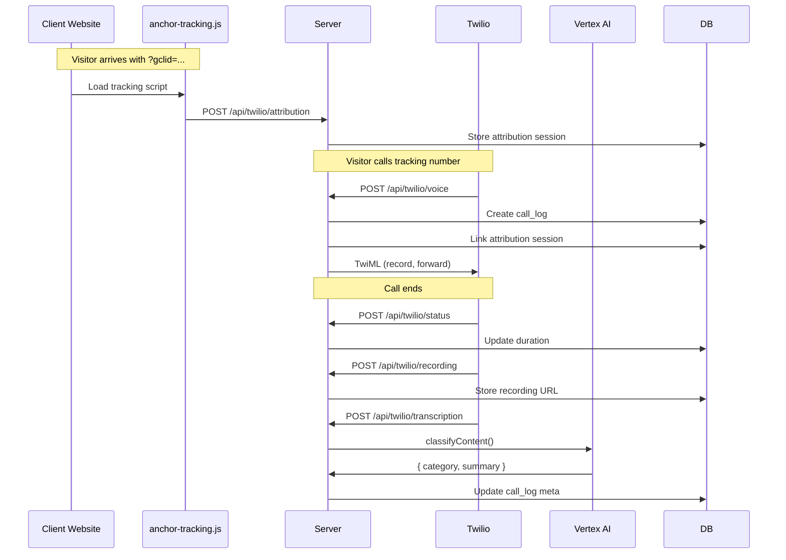
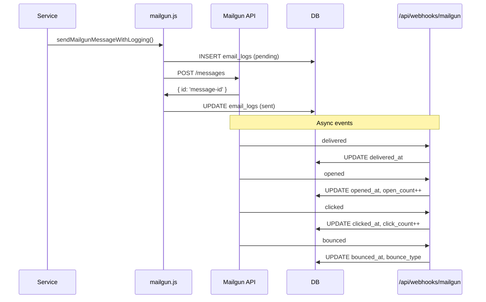
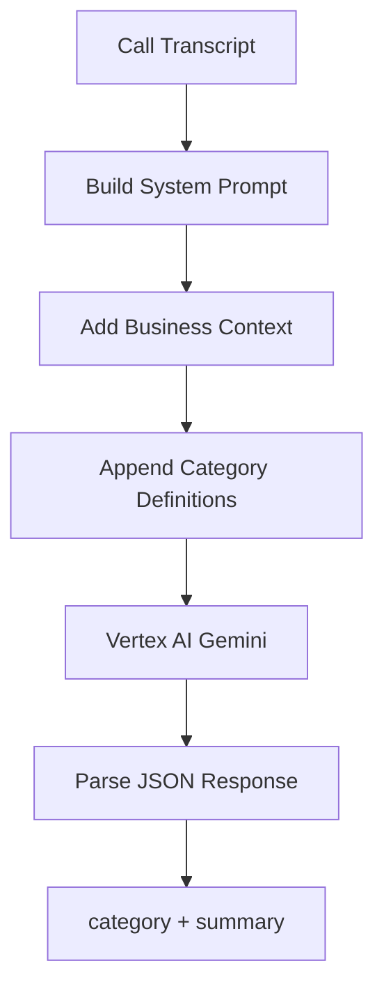
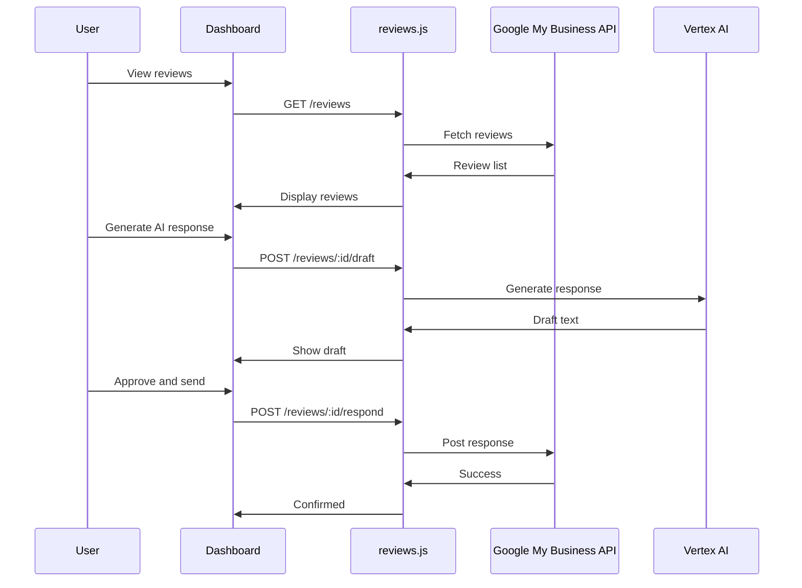
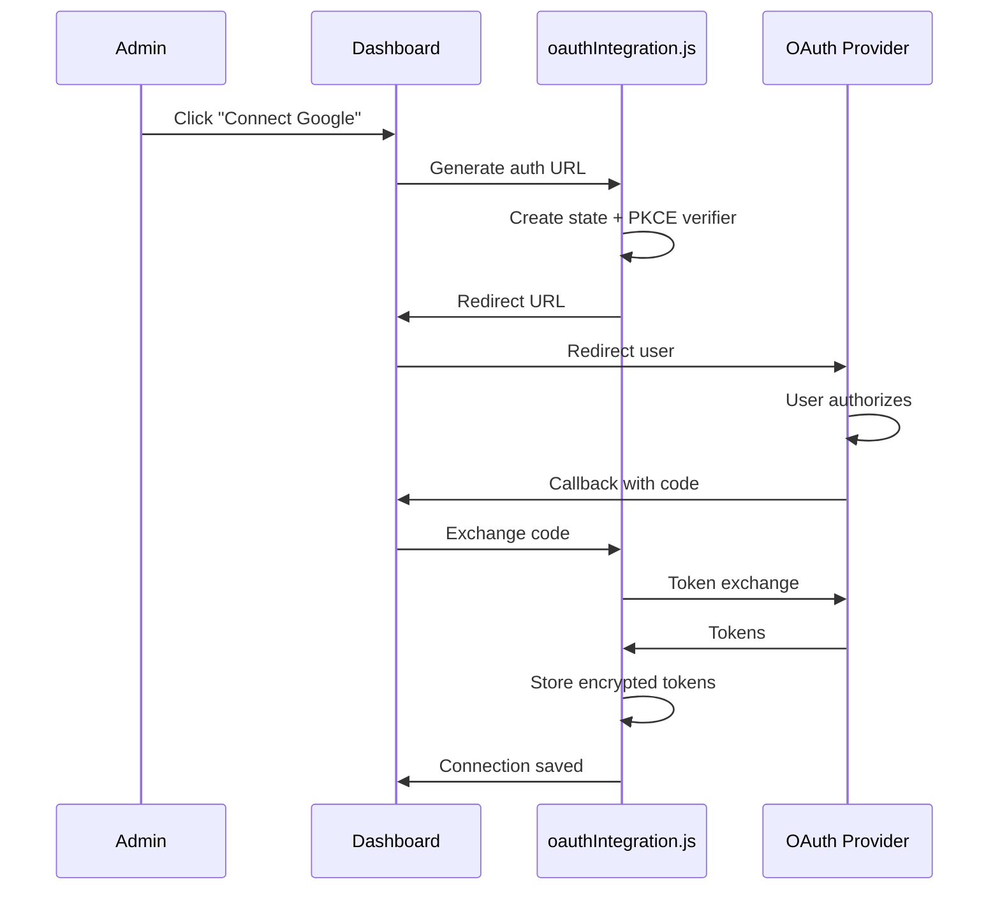

# Third-Party Integrations

> **MAINTENANCE DIRECTIVE**: Update this file when:
> - New third-party service integrations are added
> - Integration configuration or environment variables change
> - OAuth providers are added or modified
> - API keys or credentials requirements change
> - Integration service files in `server/services/` are modified
> - Webhook endpoints are added or changed

This document describes all external service integrations in the Anchor Client Dashboard.

---

## Table of Contents

1. [CallTrackingMetrics (CTM)](#1-calltrackingmetrics-ctm)
2. [Twilio](#2-twilio)
3. [Mailgun](#3-mailgun)
4. [Google Vertex AI](#4-google-vertex-ai)
5. [Google Business Profile](#5-google-business-profile)
6. [Looker](#6-looker)
7. [OAuth Providers](#7-oauth-providers)
8. [Tracking Provisioning](#8-tracking-provisioning-gtm--ga4-measurement-protocol--meta-capi)
9. [SEMrush](#9-semrush)
10. [Google Search Console (GSC)](#10-google-search-console-gsc)
11. [PageSpeed Insights (PSI)](#11-pagespeed-insights-psi)
12. [WPScan / WPVuln](#12-wpscan--wpvuln)

---

## 1. CallTrackingMetrics (CTM)

### Overview

CTM provides call tracking, recording, and scoring for leads. The integration syncs call data, transcripts, and ratings.

### Configuration

**Per-client settings in `client_profiles`:**

| Column | Description |
|--------|-------------|
| `ctm_account_number` | CTM account ID |
| `ctm_api_key` | API key |
| `ctm_api_secret` | API secret |
| `ctm_sync_cursor` | Last sync timestamp |
| `ctm_last_page_token` | Pagination state |

### Service Location

`server/services/ctm.js`

### Key Functions

| Function | Purpose |
|----------|---------|
| `fetchCtmCalls(config, sinceTimestamp)` | Fetch calls from CTM API |
| `pullCallsFromCtm(clientId)` | Full sync flow with classification |
| `buildCallsFromCache(clientId)` | Load calls from local database |
| `postSaleToCTM(callId, score)` | Update rating in CTM |
| `classifyContent(prompt, transcript)` | AI classify call content |
| `enrichCallerType(call, clientId)` | Detect repeat/returning callers |

### Sync Flow



### Two-Way Rating Sync

When rating changes in the Dashboard:
1. `POST /api/hub/calls/:id/score` called
2. `postSaleToCTM(callId, score)` updates CTM
3. Local `call_logs.score` updated

When rating exists in CTM:
1. `pullCallsFromCtm()` reads CTM score
2. Score is applied to local record
3. Category recalculated from rating

### Lead Categories

| Category | Auto-Star | Description |
|----------|-----------|-------------|
| `very_good` | ⭐⭐⭐ | Ready to buy |
| `warm` | ⭐⭐⭐ | Interested lead |
| `needs_attention` | ⭐⭐⭐ | Callback requested |
| `not_a_fit` | ⭐⭐ | Not qualified |
| `applicant` | ⭐⭐ | Job inquiry |
| `spam` | ⭐ | Junk call |
| `converted` | — | Manual only (5 stars) - agreed to service |
| `voicemail` / `unanswered` / `neutral` | — | Described but not scored |

> **Auto-star caps at 3.** Ratings 4 and 5 are manual only (never auto-assigned). See `getAutoStarRating()` in `server/services/ctm.js`.

### CTM API Reference

```javascript
// Example: Fetch calls
const response = await fetch(
  `https://api.calltrackingmetrics.com/api/v1/accounts/${accountId}/calls`,
  {
    headers: {
      'Authorization': `Basic ${Buffer.from(`${apiKey}:${apiSecret}`).toString('base64')}`
    }
  }
);
```

---

## 2. Twilio

### Overview

Twilio provides call tracking as an alternative to CTM. It uses a **push-based** webhook architecture (vs. CTM's pull-based polling). Key features:

- Real-time call handling via webhooks
- Tracking number management (purchase, configure, release)
- Call recording and transcription (Twilio Intelligence)
- Full attribution tracking (GCLID, Facebook Pixel, UTMs)

### Architecture Comparison

| Feature | CTM | Twilio |
|---------|-----|--------|
| Data Flow | Pull (polling) | Push (webhooks) |
| Credentials | Per-client API keys | Per-client Account SID/Auth Token |
| Phone Numbers | Managed in CTM | Purchased via API |
| Transcription | CTM transcription | Twilio Intelligence |
| Attribution | Limited | Full (gclid, fbclid, UTMs) |

### Configuration

**Per-client settings in `twilio_client_configs`:**

| Column | Description |
|--------|-------------|
| `account_sid` | Twilio Account SID (encrypted) |
| `auth_token` | Twilio Auth Token (encrypted) |
| `twiml_app_sid` | TwiML App SID |
| `webhook_secret` | Webhook signing secret |

### Service Location

`server/services/twilio.js`

### Key Functions

| Function | Purpose |
|----------|---------|
| `getTwilioClient(clientUserId)` | Get authenticated Twilio client |
| `saveTwilioConfig(clientUserId, credentials)` | Save encrypted credentials |
| `purchasePhoneNumber(clientUserId, options)` | Buy tracking number |
| `releasePhoneNumber(trackingNumberId)` | Release number |
| `configureTracking(trackingNumberId, forwardTo)` | Set up forwarding + recording |
| `handleIncomingCall(trackingNumberId, callData)` | Generate TwiML response |
| `handleCallStatus(callSid, status, duration)` | Process status webhooks |
| `handleRecordingReady(callSid, recordingUrl)` | Trigger transcription |
| `handleTranscription(callSid, transcriptionData)` | Process transcript |
| `classifyTwilioCall(clientUserId, transcript)` | AI classification |
| `storeAttribution(data)` | Store visitor attribution |
| `linkAttributionToCall(callLogId, sessionId)` | Link attribution to call |

### Call Flow



### Webhook Endpoints

All webhooks are in `server/routes/twilio.js`:

| Endpoint | Purpose |
|----------|---------|
| `POST /api/twilio/voice` | Incoming call - returns TwiML |
| `POST /api/twilio/status` | Call status changes |
| `POST /api/twilio/recording` | Recording ready |
| `POST /api/twilio/transcription` | Transcription ready |
| `POST /api/twilio/attribution` | Website visitor attribution |

### Attribution Tracking

The universal tracking script (`/tracking/anchor-tracking.js`) captures:

| Parameter | Source |
|-----------|--------|
| `gclid`, `gbraid`, `wbraid` | Google Ads |
| `fbclid`, `fbc`, `fbp` | Facebook/Meta |
| `utm_source`, `utm_medium`, etc. | UTM parameters |
| `landing_page` | First page visited |
| `referrer` | HTTP referrer |

**Installation on client websites:**
```html
<script src="https://your-domain.com/tracking/anchor-tracking.js"
        data-client-id="CLIENT_UUID"
        data-api-base="https://your-domain.com/api"
        async></script>
```

### Security

- Twilio credentials encrypted at rest (AES-256-GCM)
- Webhook signatures validated in production
- IP addresses hashed before storage
- No PHI in logs

### Admin UI

Call Tracking Tab in AdminHub (`src/views/admin/CallTrackingTab.jsx`):

- Provider selection (CTM/Twilio)
- Twilio credentials configuration
- Tracking numbers management
- Attribution script generator

---

## 3. Mailgun

### Overview

Mailgun handles all outbound email: onboarding invitations, notifications, password resets, and form submissions.

### Configuration

**Environment Variables:**

| Variable | Description |
|----------|-------------|
| `MAILGUN_API_KEY` | API key |
| `MAILGUN_DOMAIN` | Sending domain |
| `MAILGUN_FROM_EMAIL` | From address |
| `MAILGUN_FROM_NAME` | From display name |

### Service Location

`server/services/mailgun.js`

### Key Functions

| Function | Purpose |
|----------|---------|
| `sendMailgunMessage(options)` | Send email (low-level) |
| `sendMailgunMessageWithLogging(options)` | Send with database logging |
| `fetchEmailLogs(filters)` | Get logged emails |
| `getEmailStats()` | 30-day statistics |
| `updateEmailLogTracking(mailgunId, event, data)` | Process webhook events |

### Email Flow



### Email Types

| Type | Trigger |
|------|---------|
| `onboarding_invite` | Admin creates client |
| `onboarding_complete` | Client completes onboarding |
| `onboarding_reminder` | Token expiring soon |
| `password_reset` | User requests reset |
| `form_submission` | Form submitted |
| `rush_job_notification` | Task marked rush |
| `blog_notification` | Blog published |
| `document_review` | Document needs review |

### Webhook Configuration

Set up in Mailgun dashboard:
- URL: `https://your-domain.com/api/webhooks/mailgun`
- Events: `delivered`, `opened`, `clicked`, `bounced`, `complained`, `unsubscribed`

### Email Tracking Fields

| Field | Description |
|-------|-------------|
| `delivered_at` | When delivered |
| `opened_at` | First open |
| `open_count` | Total opens |
| `clicked_at` | First click |
| `click_count` | Total clicks |
| `bounced_at` | Bounce timestamp |
| `bounce_type` | `hard` or `soft` |
| `complained_at` | Spam complaint |
| `unsubscribed_at` | Unsubscribe |
| `delivery_status` | DKIM/DMARC/TLS details |

---

## 4. Google Vertex AI

### Overview

Vertex AI powers:
- Call transcript classification
- Blog content generation
- Form submission processing
- Review response drafting
- AI task summaries

### Configuration

**Environment Variables:**

| Variable | Description |
|----------|-------------|
| `GOOGLE_APPLICATION_CREDENTIALS` | Service account key path |
| `GCP_PROJECT_ID` | Google Cloud project |
| `VERTEX_LOCATION` | Region (e.g., `us-central1`) |
| `VERTEX_MODEL` | Default model |
| `VERTEX_CLASSIFIER_MODEL` | Model for classification |
| `VERTEX_IMAGEN_MODEL` | Model for image generation |

### Service Locations

- `server/services/ai.js` - General AI generation
- `server/services/ctm.js` - Classification logic
- `server/services/imagen.js` - Image generation

### Key Functions

| Function | Location | Purpose |
|----------|----------|---------|
| `generateAiResponse(options)` | `ai.js` | General text generation |
| `classifyContent(prompt, transcript)` | `ctm.js` | Classify call/form |
| `generateImagenImage(prompt)` | `imagen.js` | Generate image |

### Classification Flow



### Category Definitions

The AI prompt includes canonical category definitions:

```javascript
export const CATEGORY_DEFINITIONS = `
Respond ONLY with JSON like {"category":"warm","summary":"One sentence summary"}.
Categories:
- warm (Promising lead interested in services)
- very_good (High-intent lead, ready to book/buy)
- voicemail (Voicemail left with no actionable details)
- needs_attention (Voicemail indicating they want services)
- unanswered (No conversation occurred)
- not_a_fit (Not interested or not a fit for services)
- spam (Irrelevant call, telemarketer)
- neutral (General inquiry)
- applicant (Job/career inquiry ONLY)
- unreviewed (Default state)
`;
```

**Note:** `converted` is NOT in the AI list - it's manual-only.

### Model Configuration

```javascript
const options = {
  prompt: 'User content here',
  systemPrompt: 'Business context + categories',
  temperature: 0.2,  // Low for classification
  maxTokens: 200,
  model: process.env.VERTEX_CLASSIFIER_MODEL
};

const response = await generateAiResponse(options);
```

---

## 5. Google Business Profile

### Overview

Integration for managing Google Business Profile reviews:
- Fetch reviews
- Draft AI responses
- Post responses

### Configuration

OAuth-based - requires user authorization:
1. Admin configures OAuth provider credentials
2. Client connects their Google account
3. Selects business location(s)

### Service Location

`server/services/oauthIntegration.js`

### Key Functions

| Function | Purpose |
|----------|---------|
| `buildGoogleAuthUrl()` | Generate OAuth URL |
| `exchangeCodeForTokens()` | Complete OAuth flow |
| `fetchGoogleBusinessAccounts()` | Get business accounts |
| `fetchGoogleBusinessLocations()` | Get locations |
| `refreshGoogleAccessToken()` | Refresh expired token |

### Review Management Flow



### OAuth Tables

| Table | Purpose |
|-------|---------|
| `oauth_providers` | Admin-configured credentials |
| `oauth_connections` | Client connections |
| `oauth_resources` | Locations/pages under connection |

---

## 6. Looker

### Overview

Embedded Looker dashboards provide analytics to clients.

### Configuration

**Per-client in `client_profiles`:**

| Column | Description |
|--------|-------------|
| `looker_url` | Embed URL for client's dashboard |

**Environment Variable (CSP):**

| Variable | Description |
|----------|-------------|
| `CSP_FRAME_SRC` | Allowed iframe sources |

### Implementation

```jsx
// Client Portal - Analytics tab
{profile.looker_url && (
  <Box sx={{ height: '80vh' }}>
    <iframe
      src={profile.looker_url}
      width="100%"
      height="100%"
      frameBorder="0"
      title="Analytics Dashboard"
    />
  </Box>
)}
```

### CSP Configuration

```bash
# .env
CSP_FRAME_SRC=https://looker.yourdomain.com,https://lookerstudio.google.com
```

---

## 7. OAuth Providers

### Overview

The system supports multiple OAuth providers for various integrations:

| Provider | Login | Integration |
|----------|-------|-------------|
| Google | ✅ | Google Business Profile |
| Microsoft | ✅ | - |
| Facebook | - | Page management |
| Instagram | - | Account management |
| TikTok | - | Account management |
| WordPress | - | Blog publishing |

### Database Schema

**oauth_providers** (Admin-configured):
```sql
CREATE TABLE oauth_providers (
  id UUID PRIMARY KEY,
  provider TEXT NOT NULL,  -- google, facebook, etc.
  client_id TEXT NOT NULL,
  client_secret TEXT NOT NULL,
  redirect_uri TEXT,
  auth_url TEXT,
  token_url TEXT,
  scopes JSONB NOT NULL DEFAULT '[]',
  is_active BOOLEAN DEFAULT TRUE
);
```

**oauth_connections** (Per-client):
```sql
CREATE TABLE oauth_connections (
  id UUID PRIMARY KEY,
  client_id UUID REFERENCES users(id),
  provider TEXT NOT NULL,
  provider_account_id TEXT NOT NULL,
  provider_account_name TEXT,
  access_token TEXT,
  refresh_token TEXT,
  expires_at TIMESTAMPTZ,
  is_connected BOOLEAN DEFAULT TRUE,
  -- Security fields
  encrypted_access_token TEXT,
  encrypted_refresh_token TEXT,
  token_hash TEXT,
  kms_key_id TEXT
);
```

**oauth_resources** (Locations/Pages):
```sql
CREATE TABLE oauth_resources (
  id UUID PRIMARY KEY,
  client_id UUID REFERENCES users(id),
  oauth_connection_id UUID REFERENCES oauth_connections(id),
  provider TEXT NOT NULL,
  resource_type TEXT NOT NULL,  -- google_location, facebook_page, etc.
  resource_id TEXT NOT NULL,
  resource_name TEXT NOT NULL,
  is_primary BOOLEAN DEFAULT FALSE
);
```

### OAuth Flow



### Token Refresh

```javascript
// Automatic token refresh before API calls
async function withFreshToken(connection, apiCall) {
  if (connection.expires_at < new Date()) {
    const newTokens = await refreshAccessToken(connection);
    await saveOAuthConnection(connection.id, newTokens);
    connection.access_token = newTokens.access_token;
  }
  return apiCall(connection.access_token);
}
```

---

## 8. Tracking Provisioning (GTM + GA4 Measurement Protocol + Meta CAPI)

### Overview

Internal system for provisioning GTM-based tracking per client. Configures tags, triggers, and variables in GTM containers via the Tag Manager API. Relays server-side conversion events to GA4 Measurement Protocol and Meta Conversions API with HIPAA-safe field scrubbing for medical clients.

### External APIs Used

- **Google Tag Manager API v2** — workspace/tag/trigger/variable CRUD, version creation, publishing
- **GA4 Measurement Protocol** — server-side event forwarding (`POST /mp/collect`)
- **Meta Conversions API (CAPI)** — server-side event forwarding (`POST /v18.0/{pixel_id}/events`)

### Authentication

- GTM API: GCP service account (`anchor-client-hub@anchor-hub-480305.iam.gserviceaccount.com`)
- GA4 MP: Per-client API secret (stored encrypted in `tracking_configs.ga4_api_secret`)
- Meta CAPI: Per-client access token (stored encrypted in `tracking_configs.meta_capi_token`)

### HIPAA Compliance

- Medical clients: allowlist-only field scrubbing — only event name, timestamp, domain (no path), and conversion value are sent
- Non-medical clients: blocklist scrubbing with SHA-256 hashed PII for Enhanced Conversions
- Event relay logs store post-scrubbing payloads only (no PHI)
- 30-day retention on event logs (purged by cron)

### Key Files

| File | Purpose |
|------|---------|
| `server/services/trackingProvisioning.js` | GTM API provisioning |
| `server/services/trackingRelay.js` | Event relay with scrubbing |
| `server/services/trackingTemplates.js` | Template loading and substitution |
| `server/routes/tracking.js` | API endpoints |
| `src/views/admin/AdminHub/TrackingTab.jsx` | Admin UI |

---

## 9. Kinsta (Operations)

**What it does:** Drives the Operations console — list sites and environments, fetch SSH credentials, push between staging/live, and (longer-term) trigger Kinsta operations.

**API base:** `https://api.kinsta.com/v2`

**Auth:** Bearer token (single agency-level API key, not per-client).

**Required env vars:**
```
KINSTA_API_KEY=<bearer token>
KINSTA_AGENCY_ID=<company id>
KINSTA_USER=<dashboard email>          # not used by the API client itself
KINSTA_USER_PASSWORD=<dashboard pwd>   # reserved for future SSO scenarios
```

All four are wired into the Cloud Run revision via Secret Manager (`anchor-hub` service, `us-central1`).

**Key endpoints used (`server/services/operations/kinstaApi.js`):**
- `GET /sites?company=<agencyId>&include_environments=true` — list 132 sites + envs in one call.
- `GET /sites/environments/:envId` — environment detail.
- `GET /sites/environments/:envId/ssh/password` — fetch a fresh SFTP/SSH password (rotated). 429/5xx are retried with exponential backoff.
- `PUT /sites/:siteId/environments` — push DB + files between envs.
- `GET /operations/:operationId` — poll a long-running Kinsta operation.

**SSH transport:** `ssh2` npm (NOT sshpass). See feedback memory `feedback_ssh_via_ssh2_not_sshpass`. Each `execCommand` opens its own connection; passwords are decrypted just-in-time and refreshed automatically when missing/stale.

**Encryption:** SSH passwords stored in `kinsta_environments.ssh_password_encrypted` use Anchor's `services/security/encryption.js` (AES-256-GCM, `iv:tag:ciphertext` base64 format). Never returned to the frontend — `serializeEnvironment()` strips the column and exposes only `ssh_password_present: boolean`.

**Read-only lock:** Set `kinsta_environments.metadata.read_only = true` to block any non-read WP-CLI command on that env. Toggleable from the Site drawer Overview tab. Belt-and-suspenders enforcement at the `execCommand` boundary; the agent is also told about the lock via system prompt.

**Cloud Run egress:** Outbound port 22 to Kinsta SSH endpoints is unrestricted by default. If a future restriction blocks it, allowlist `*.kinsta.cloud` (Kinsta does not publish a static IP range).

---

## Integration Checklist

### Adding a New Integration

1. [ ] Create service file in `server/services/`
2. [ ] Add required environment variables
3. [ ] Update database schema if needed
4. [ ] Create API endpoints in appropriate router
5. [ ] Add frontend API client in `src/api/`
6. [ ] Update CSP if external resources needed
7. [ ] Document in this file
8. [ ] Test with real credentials

### Environment Variables Summary

```bash
# CTM
CTM_API_KEY=
CTM_API_SECRET=

# Mailgun
MAILGUN_API_KEY=
MAILGUN_DOMAIN=
MAILGUN_FROM_EMAIL=
MAILGUN_FROM_NAME=

# Google Cloud / Vertex AI
GOOGLE_APPLICATION_CREDENTIALS=
GCP_PROJECT_ID=
VERTEX_LOCATION=us-central1
VERTEX_MODEL=gemini-2.0-flash-001
VERTEX_CLASSIFIER_MODEL=gemini-2.0-flash-001
VERTEX_IMAGEN_MODEL=imagen-3.0-generate-001

# CSP (frame sources for embeds)
CSP_FRAME_SRC=https://looker.yourdomain.com

# CSP (image sources)
CSP_IMG_SRC=https://storage.googleapis.com
```

---

---

## 9. SEMrush

### Overview

SEMrush powers the website-umbrella SEO checks (organic-traffic drop, top
keywords lost, toxic backlinks). Used inside the Operations rebuild only —
no UI calls SEMrush directly.

### Configuration

| Variable | Description |
|---|---|
| `SEMRUSH_API_KEY` | Single agency-level API key |

### Auth pattern

Static API key sent as a query string parameter. Agency-level — the same
key is used for every client's website checks. Quota is shared.

### Where it's used

- `server/services/ops/checks/website/semrush*.js`
- Surfaced via the `web.seo.semrush_*` checks bundled in
  `web_weekly_deep` and `web_monthly_audit` run definitions.

See [OPERATIONS.md](OPERATIONS.md#4-check-registry--umbrellas) for how
SEMrush results flow into `ops_findings`.

---

## 10. Google Search Console (GSC)

### Overview

Powers website-umbrella search-performance checks. **Per-client OAuth**
(P2 of the Operations rebuild) — each client's Search Console property
is authorized via their own Google account.

### Configuration

| Variable | Description |
|---|---|
| `GSC_OAUTH_CLIENT_ID` / `_SECRET` | Reused from the standard Google OAuth app (same client app used for Drive / Calendar) |

Refresh tokens land in `oauth_connections` (provider=`google`, scope
includes `webmasters.readonly`).

### Where it's used

- `server/services/ops/checks/website/gsc.js`
- Per-client refresh token loaded inside the run executor and threaded
  through the Search Console v1 API client.

See [OPERATIONS.md](OPERATIONS.md) and the per-client OAuth scaffold
in Phase 5.5 of `docs/ops-rebuild/phases/phase-3-completion.md`.

---

## 11. PageSpeed Insights (PSI)

### Overview

Composite Core Web Vitals + lab metrics. Locked as PSI-first per P3 of
the rebuild; if quota becomes painful, swap to Lighthouse-CI without API
contract changes.

### Configuration

| Variable | Description |
|---|---|
| `PSI_API_KEY` | Single agency-level Google API key. Public quota lives behind this key. |

### Where it's used

- `server/services/ops/checks/website/psi.js` (composite `web.psi`
  check) + `psi_run_now` tool exposed to the website sub-agent.
- Quota tracker in the same module so we don't blow the daily limit.

---

## 12. WPScan / WPVuln

### Overview

WordPress vulnerability feed. Mirrored locally into `ops_vuln_feed`
(see `migrate_ops_vuln_feed.sql`) and cross-referenced by the
`web.wp_security` check against installed plugin/theme versions on
each client's WP install.

### Configuration

| Variable | Description |
|---|---|
| `WPSCAN_API_TOKEN` | Single agency-level token; mirror runs as a cron tick |

### Where it's used

- `server/services/ops/feeds/wpvuln.js` — mirror job
- `server/services/ops/checks/website/wpSecurity.js` — per-run
  cross-reference

See [OPERATIONS.md](OPERATIONS.md#4-check-registry--umbrellas).

---

## 13. Social Publishing (Facebook + Instagram)

**What it does:** Lets agency staff compose, schedule, and publish FB Page + Instagram Business posts (text, image, carousel, video) for managed clients from inside the Admin Hub.

**Auth model:** Reuses the existing `FACEBOOK_SYSTEM_USER_TOKEN` env var (the same system user already used by `metaAdsAdapter.js` for the analytics dashboard). The token has `pages_manage_posts`, `pages_read_engagement`, `instagram_basic`, `instagram_content_publish`, and related scopes already approved. No per-client OAuth required.

**Per-Page tokens:** Resolved from the system user via `GET /me/accounts`, encrypted with AES-256-GCM via `server/services/security/encryption.js`, and cached in `meta_page_links.page_access_token_encrypted`. Lazy-refreshed on miss or 190 error.

**Vimeo videos:** Resolved at publish time to a direct mp4 URL via the Vimeo API. Requires `VIMEO_ACCESS_TOKEN` (Premium-tier account). Free/Plus accounts do not expose progressive file URLs.

**Image hosting:** Uploaded images are stored in `file_uploads` (BYTEA, category='social') and served at publish time via a public HMAC-signed endpoint `/api/social/media/:token` that Meta's servers fetch. Token TTL is 1 hour; HMAC secret is `SOCIAL_MEDIA_SECRET`. The `social_media_tokens` DB table records issued tokens for revocation only.

**Cron:** In-process `node-cron` job runs every 2 minutes (America/New_York) to claim due posts under `FOR UPDATE SKIP LOCKED`, mark them `publishing`, and dispatch per platform. Daily 4 AM job runs `healthCheckPage` on every active link to refresh `last_health_status`.

**Per-client opt-in:** The cron only fires for clients with `meta_page_links.scheduling_enabled = true`. Defaults to false; admins flip it via the Connections tab. This is required by the no-unattended-crons policy in CLAUDE.md.

**HIPAA:** No PHI in post bodies — posts are public outbound content authored by admin staff. Medical clients receive a PHI advisory in the compose dialog. All state-changing endpoints write to `security_audit_log` with `social.*` event types.

**Required env vars:**
- `FACEBOOK_SYSTEM_USER_TOKEN` — already configured (also used by Meta Ads adapter)
- `VIMEO_ACCESS_TOKEN` — required to publish Vimeo-sourced videos
- `SOCIAL_MEDIA_SECRET` — HMAC secret (32+ bytes of random hex), used to sign tokens for the public media endpoint
- `PUBLIC_BASE_URL` (or `APP_URL`) — used to construct the public media URL Meta fetches

**Where to look:**
- Backend: `server/routes/social.js`, `server/services/metaPagePosting.js`, `server/services/socialPublisher.js`, `server/services/socialMediaTokens.js`, `server/services/vimeo.js`
- Frontend: `src/views/admin/AdminHub/social/`, `src/api/social.js`
- Reusable Calendar: `src/ui-component/extended/Calendar/`
- Schema: `meta_page_links`, `social_posts`, `social_media_tokens`

---

## Demo Deployment

The demo runs as a separate Cloud Run service (`anchor-hub-demo`) using the same container image as production, backed by a dedicated empty `anchor_demo` database on the existing `anchor` Cloud SQL instance.

### Isolation model

**PRIMARY guard — no credentials.** The demo service is deployed without any third-party credentials (CTM, Twilio, Mailgun, Google Ads, Meta). Outbound integrations cannot reach external systems because the required env vars are absent.

**SECONDARY guard — `DEMO_MODE=true`.** The `isDemoMode()` helper suppresses:
- Mailgun email sends (`server/services/mailgun.js`)
- Server-side tracking relay (`server/services/trackingRelay.js`)
- Twilio outbound calls and config writes (`server/services/twilio.js`)
- `send_webhook` automation action (`server/services/taskAutomations.js`)
- All cron jobs (guarded in `server/index.js` startup)

### Client-portal-only access

A fresh `anchor_demo` database contains **no admin or superadmin accounts** (verified on fresh-DB migration run, 2026-06-04). The only seeded users are `client`-role accounts (`demo@anchorcorps.com` plus two demo team members), all with `is_demo = true`. The demo banner shown in the client portal is triggered automatically by the `is_demo` flag.

### Data freshness

`maybeSeedDemoAccount()` (called in `server/services/demoSeed.js`) runs on every startup. It upserts the demo client, sample call logs, active clients, journeys, tasks, and notifications — resetting any changes made by visitors and keeping the demo fresh. The same seed function also maintains the demo client row in the production `anchor` database.

### Schema

The `anchor_demo` database is initialized by the full startup migration chain (`server/sql/init.sql` + ~90 migrations). The chain has been verified to complete cleanly on a brand-new empty database. The seed file is `server/sql/seed_demo.sql`.

---

## Related Documentation

- [OPERATIONS.md](OPERATIONS.md) - Operations command-center architecture (multi-platform health checks)
- [ARCHITECTURE.md](ARCHITECTURE.md) - System architecture
- [API_REFERENCE.md](API_REFERENCE.md) - API endpoints
- [SECURITY.md](SECURITY.md) - OAuth security details
- [DATA_FLOWS.md](DATA_FLOWS.md) - Integration workflows
- [SKILLS.md](../SKILLS.md) - Database schema

---

*Last updated: June 2026*

