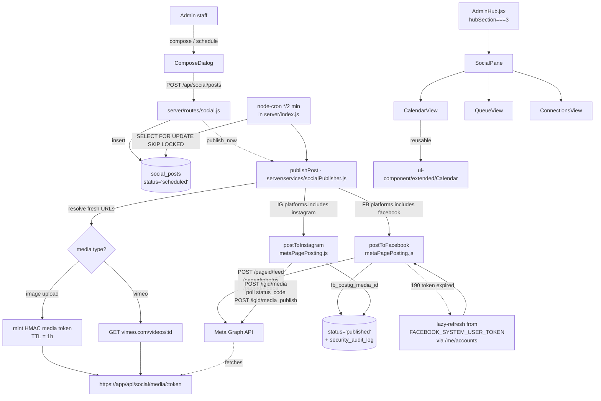

# Social Publishing (FB + IG) — Expanded Implementation Plan

> **For agentic workers:** REQUIRED SUB-SKILL: Use superpowers:subagent-driven-development (recommended) or superpowers:executing-plans to implement this plan task-by-task. Steps use checkbox (`- [ ]`) syntax for tracking.
>
> **Branch policy:** Work directly on `main`. Per-user instruction (2026-05-11). No `feature/social-publishing` branch. Commit in small, reviewable increments per task.

## Context

Anchor's agency staff currently has no in-app way to publish content to clients' Facebook Pages and Instagram Business accounts — every post is done by hand through Meta Business Suite, which means context-switching, no audit trail, and no shared schedule. The agency already holds a Meta system user token (`FACEBOOK_SYSTEM_USER_TOKEN`) with access to every managed client's Page, so the auth substrate exists; we just need the workflow on top.

This change introduces a Social tab inside the Admin Hub for composing, scheduling, and publishing FB Page + IG Business posts (text, single image, carousel, video) across all managed clients. A by-product is a generic `<Calendar />` component placed under `ui-component/extended/Calendar/` so other surfaces (Tasks, Reviews scheduling, Onboarding milestones) can adopt it later.

**Compliance posture.** Posts are public outbound content, not PHI ingress, but the auditor needs trails: every link, scheduling-toggle, create, schedule, cancel, publish, and failure writes to `security_audit_log`. Page access tokens are encrypted at rest. Per-client `scheduling_enabled` defaults `false` — the cron only fires for clients an admin has explicitly opted in. The public media endpoint that Meta fetches uses HMAC-signed tokens, not enumerable IDs. For medical clients we surface a PHI advisory at compose time; we do not block, because the post itself is admin-authored and admin-reviewed.

---

## Codebase reality check — what the previous draft got wrong

Five issues in the prior draft would have failed at build/runtime. I verified each against the source:

| Previous draft assumed | Actual codebase | Fix |
|---|---|---|
| `import { pool } from '../db.js'` | `server/db.js` exports `query` and `getClient`; **no `pool` export** | Use `query(sql, params)`; use `getClient()` only when a transaction is required |
| `file_uploads` has columns `content`, `mime_type`, `filename`, `client_id`, `uploaded_by`, `purpose` | Actual: `category, owner_id, owner_type, original_name, content_type, size_bytes, hash, bytes, metadata` (see `server/sql/migrate_file_storage.sql`) | Reuse the existing `storeFile()` helper in `server/services/fileStorage.js`; tag rows with `category='social'`; no new column on `file_uploads` is needed |
| `import { requireAuth, isStaff } from '../middleware/index.js'` | No `middleware/index.js`. `requireAuth` is in `server/middleware/auth.js`; `isStaff` is in `server/middleware/roles.js` | Two separate imports |
| `logAuditEvent({ actorId, action, targetId, meta })` writing to `audit_log` | Actual: `logSecurityEvent({ eventType, eventCategory, userId, success, details })` in `server/services/security/audit.js`; table is `security_audit_log`; sensitive keys are stripped from `details` by `sanitizeDetails` | Match the real signature; use a new `eventCategory='access'` and event types prefixed `social.*` |
| `client_profiles(id)` is the FK target | `client_profiles.user_id` is the PK; it references `users(id) ON DELETE CASCADE` | New FKs target `users(id) ON DELETE CASCADE` and the variable name stays `client_id` (the user UUID is "the client") to match how the rest of the codebase talks about clients |
| `date-fns` "already in deps" | Not in `package.json`. `dayjs` is the project's date lib | Build Calendar on `dayjs` |
| `node-fetch` imported | Native fetch (Node 20) used throughout | Drop the import |
| `'@mui/material/Grid'` aliased to `GridLegacy` | True (CLAUDE.md gotcha #10) | Avoid Grid in new code; use CSS Grid via `Box sx={{ display: 'grid' }}` (already what plan does) |
| Cloud Scheduler hits `/run-scheduled` | The project runs many in-process `node-cron` jobs from `server/index.js` (lines 1592-1748+), including `*/5 * * * *` for recurring tasks | Add an in-process `cron.schedule('*/2 * * * *', ...)`; no external scheduler, no token, no public endpoint to defend |
| `apiClient` named import | `src/api/client.js` default-exports an axios instance; baseURL is `/api`; consumers use `client.get('/hub/clients')` not `/api/hub/clients` | Match the pattern |
| DataTable uses DataGrid props (`field`, `headerName`, `renderCell`) | Actual API is `{ id, label, render, sortable, sortValue }` (see `src/ui-component/extended/DataTable.jsx` line 28) | Use the real shape |
| Top-level "Social" tab inside AdminHub | AdminHub has TWO tab levels: a top "hubSection" (Users & Clients / Email Logs / Tutorials at lines 1699-1703) and a per-client drawer with details/forms/tracking etc. | Add Social as a 4th `hubSection` top-level tab, mirroring `EmailLogsSection`'s `active={hubSection === N}` pattern |

There's also one architectural correction that's not a bug but a meaningful reduction in surface area:

**Vimeo file URLs expire.** They're typically valid 4-6 hours. The previous draft stored the resolved `public_url` in `social_posts.media[].public_url` at compose time, which would silently break every scheduled video post longer than ~6h out. The fix: store only `{ type: 'video', source: 'vimeo', vimeo_id }` and resolve to a direct mp4 URL **at publish time**, inside `publishPost()`. Same for uploaded images served via our own endpoint — generate the signed URL at publish time, not at compose time, so token lifetime can be short.

---

## Architecture diagram



The publish path is the load-bearing piece. The cron claims rows atomically, resolves fresh URLs (because Vimeo links rot and we want short-lived image tokens), and dispatches per-platform. IG is two-step (container + publish) with a polling loop because Meta returns the container ID immediately but takes 5-60s to process the media; we cap polling at 2 min for images, 10 min for video. FB is one-step except carousels (which stage child photos unpublished, then attach to a feed post).

---

## Files

**New backend:**
- `server/sql/migrate_social_publishing.sql` — `meta_page_links`, `social_posts`, `social_media_tokens` (NEW vs. previous draft: no column on `file_uploads`)
- `server/services/vimeo.js` — Vimeo direct-URL resolver
- `server/services/metaPagePosting.js` — token resolution, FB publish, IG publish (single/carousel/Reel)
- `server/services/socialPublisher.js` — `publishPost(postId)`, `runDuePosts()`, `resolveMediaUrl(item)`
- `server/services/socialMediaTokens.js` — HMAC mint + verify (no DB lookup needed in hot path)
- `server/routes/social.js` — REST endpoints + the public `/media/:token` handler in the same router
- `server/utils/socialValidation.js` — Meta platform constraints (caption length, carousel size, aspect ratios)

**Modified backend:**
- `server/index.js` — register migration, mount router, add `'/api/social/media/'` to `publicCorsEndpoints`, add `cron.schedule('*/2 * * * *', runDuePosts)` and a daily health-check cron

**New frontend:**
- `src/api/social.js` — axios calls
- `src/ui-component/extended/Calendar/Calendar.jsx`
- `src/ui-component/extended/Calendar/CalendarDay.jsx`
- `src/ui-component/extended/Calendar/useCalendar.js`
- `src/ui-component/extended/Calendar/index.js`
- `src/views/admin/AdminHub/social/SocialSection.jsx` (matches `EmailLogsSection` naming)
- `src/views/admin/AdminHub/social/ConnectionsView.jsx`
- `src/views/admin/AdminHub/social/QueueView.jsx`
- `src/views/admin/AdminHub/social/CalendarView.jsx`
- `src/views/admin/AdminHub/social/ComposeDialog.jsx`
- `src/views/admin/AdminHub/social/MediaPicker.jsx`
- `src/utils/vimeo.js` — `parseVimeoId` (mirrors server-side)

**Modified frontend:**
- `src/views/admin/AdminHub.jsx` — append 4th tab to `hubSection` Tabs (line 1699-1703) and render `<SocialSection active={hubSection === 3} />`
- `CLAUDE.md` — Calendar row in shared component table; Social entry in "Where to look for X"

---

## Database schema

`gen_random_uuid()` is available (used throughout `init.sql`). All DDL is wrapped in `IF NOT EXISTS`. Idempotent re-runs are safe.

```sql
-- meta_page_links: per-client mapping to one FB Page (and its IG Business account, if any)
CREATE TABLE IF NOT EXISTS meta_page_links (
  id UUID PRIMARY KEY DEFAULT gen_random_uuid(),
  client_id UUID NOT NULL REFERENCES users(id) ON DELETE CASCADE, -- the "client" is a user row
  fb_page_id TEXT NOT NULL,
  fb_page_name TEXT NOT NULL,
  ig_user_id TEXT,
  ig_username TEXT,
  page_access_token_encrypted TEXT, -- AES-256-GCM via security/encryption.js
  scheduling_enabled BOOLEAN NOT NULL DEFAULT FALSE,
  last_health_check_at TIMESTAMPTZ,
  last_health_status TEXT, -- 'ok' | 'token_expired' | 'page_unauthorized' | 'unknown'
  last_health_error TEXT,
  created_at TIMESTAMPTZ NOT NULL DEFAULT NOW(),
  created_by UUID REFERENCES users(id),
  archived_at TIMESTAMPTZ,
  UNIQUE (client_id, fb_page_id)
);
CREATE INDEX IF NOT EXISTS idx_meta_page_links_client ON meta_page_links(client_id) WHERE archived_at IS NULL;

-- social_posts: full lifecycle
CREATE TABLE IF NOT EXISTS social_posts (
  id UUID PRIMARY KEY DEFAULT gen_random_uuid(),
  client_id UUID NOT NULL REFERENCES users(id) ON DELETE CASCADE,
  page_link_id UUID NOT NULL REFERENCES meta_page_links(id),
  created_by UUID NOT NULL REFERENCES users(id),
  platforms TEXT[] NOT NULL,                 -- ['facebook'] | ['instagram'] | ['facebook','instagram']
  content TEXT NOT NULL DEFAULT '',
  link_url TEXT,
  media JSONB NOT NULL DEFAULT '[]'::jsonb,  -- [{type, source, file_upload_id?, vimeo_id?}]
  scheduled_for TIMESTAMPTZ,                 -- NULL = post-now or draft
  status TEXT NOT NULL CHECK (status IN ('draft','scheduled','publishing','published','partially_published','failed','cancelled')),
  fb_post_id TEXT,                           -- after FB publish
  ig_media_id TEXT,                          -- after IG publish
  published_at TIMESTAMPTZ,
  failed_at TIMESTAMPTZ,
  error TEXT,
  retry_count INT NOT NULL DEFAULT 0,
  idempotency_key TEXT UNIQUE,               -- client-supplied, prevents double-post on retry
  meta JSONB NOT NULL DEFAULT '{}'::jsonb,
  created_at TIMESTAMPTZ NOT NULL DEFAULT NOW(),
  updated_at TIMESTAMPTZ NOT NULL DEFAULT NOW()
);
CREATE INDEX IF NOT EXISTS idx_social_posts_client_status ON social_posts(client_id, status);
CREATE INDEX IF NOT EXISTS idx_social_posts_scheduled_due ON social_posts(scheduled_for) WHERE status='scheduled';
CREATE INDEX IF NOT EXISTS idx_social_posts_calendar ON social_posts(client_id, COALESCE(scheduled_for, published_at, created_at));

-- social_media_tokens: HMAC-signed, but we still record issued tokens so we can revoke
-- (the public endpoint can verify HMAC alone; the DB row exists purely for audit + revocation)
CREATE TABLE IF NOT EXISTS social_media_tokens (
  jti TEXT PRIMARY KEY,                      -- token ID inside the HMAC payload
  file_upload_id UUID NOT NULL REFERENCES file_uploads(id) ON DELETE CASCADE,
  post_id UUID REFERENCES social_posts(id) ON DELETE CASCADE,
  expires_at TIMESTAMPTZ NOT NULL,
  revoked_at TIMESTAMPTZ,
  created_at TIMESTAMPTZ NOT NULL DEFAULT NOW()
);
CREATE INDEX IF NOT EXISTS idx_social_media_tokens_expires ON social_media_tokens(expires_at) WHERE revoked_at IS NULL;
```

A status of `partially_published` covers the case where FB publish succeeds and IG fails (or vice versa) on a cross-post. The original draft's `'failed'` collapses both legs; we want operators to see what landed.

---

## Reusable Calendar component

`<Calendar />` lives in `src/ui-component/extended/Calendar/`. Domain-agnostic — Tasks, Reviews scheduling, and onboarding milestones can adopt it without modification.

**Public API:**

```js
<Calendar
  events={events}              // [{ id, date: Date|string|dayjs, title, color?, meta? }]
  view="month"                 // 'month' | 'week'
  initialDate={new Date()}
  density="comfortable"        // 'compact' | 'comfortable' — height of day cells
  maxEventsPerDay={3}          // before "+N more" overflow
  onEventClick={(event) => {}}
  onDayClick={(date) => {}}
  onNavigate={(start, end) => {}} // fires on month/week change AND on mount
  renderEvent={(event) => <Chip />} // optional custom renderer
  loading={false}
/>
```

Built on `dayjs` (project's date lib). Provides ARIA roles (`role="grid"` on the day grid, `role="gridcell"` on each day, `role="button"` on event chips), keyboard navigation (arrow keys between cells, Enter to invoke `onDayClick`, Escape to close any popover the parent renders), and a Today button that resets the cursor.

Events with the same day are sorted by `dayjs(date).valueOf()` ascending. Overflow events collapse to a "+N more" footer that does not have built-in click handling — the parent supplies that via `onDayClick`. Loading state dims at `opacity: 0.5` rather than unmounting, so the grid doesn't reflow during refetches.

---

## Tasks

The plan is organized in dependency order. Tasks 1-8 are backend. Tasks 9-13 are frontend. Tasks 14-15 are integration + docs. All work commits directly to `main` — no feature branch.

### Task 1 — Migration + register in `server/index.js`

**Files:** create `server/sql/migrate_social_publishing.sql` (DDL above); modify `server/index.js`.

Add a `maybeRunSocialPublishingMigration()` function next to `maybeRunOpsSkillModelMigration` (around line 1868), following the exact existing pattern:

```js
async function maybeRunSocialPublishingMigration() {
  try {
    const migrationPath = path.join(path.dirname(fileURLToPath(import.meta.url)), 'sql', 'migrate_social_publishing.sql');
    const sql = await readFile(migrationPath, 'utf8');
    await query(sql);
    console.warn('[migrations] social_publishing schema ensured');
  } catch (err) {
    console.error('[migrations] social_publishing failed:', err);
  }
}
```

Append `.then(maybeRunSocialPublishingMigration)` to the chain, immediately after `.then(maybeRunOpsSkillModelMigration)` (line 1868).

**Verify:** `yarn server`, watch for `[migrations] social_publishing schema ensured`, then `psql postgresql://bif@localhost:5432/anchor -c "\d meta_page_links \d social_posts \d social_media_tokens"`.

### Task 2 — `server/services/vimeo.js`

Native fetch. Export `getDirectFileUrl(vimeoId)` returning the highest-quality progressive mp4. Export `parseVimeoId(input)` to accept raw IDs, `vimeo.com/123`, `player.vimeo.com/video/123`. Requires `VIMEO_ACCESS_TOKEN`; throws a typed error if missing so the caller can surface "Vimeo not configured" cleanly. Add the env var name (without value) to `.env.example`. **Do not modify `.env`** (CLAUDE.md compliance rule).

### Task 3 — `server/services/metaPagePosting.js` — token resolution

Reuse `fetchFacebookPages` from `server/services/oauthIntegration.js` (line 576) — do **not** duplicate it. The existing helper returns `{ id, name, accessToken, instagramBusinessAccountId, ... }`; we adapt it.

Export:
- `listAccessiblePages()` — wraps `fetchFacebookPages(process.env.FACEBOOK_SYSTEM_USER_TOKEN)`, then for any page with `instagramBusinessAccountId` calls `fetchInstagramAccountForPage` to enrich with `igUsername`.
- `linkClient({ clientId, fbPageId, createdBy })` — finds the page in the system-user list, inserts/upserts a `meta_page_links` row, encrypts the page-specific access token via `encrypt()` from `services/security/encryption.js`.
- `getPageToken(pageLinkId)` — reads the encrypted token from the DB, decrypts; on cache miss or 190 error (handled at call sites via try/catch around `graph()`), lazily re-fetches from `listAccessiblePages()` and overwrites the encrypted column.
- `healthCheckPage(pageLinkId)` — `GET /{fb_page_id}?fields=id,name` with the cached token; updates `last_health_*` columns accordingly. Distinguishes `token_expired` (code 190), `page_unauthorized` (status 403), `unknown` (other).
- Internal `graph(path, params, method, body)` helper that throws typed errors `{ status, code, subcode, fbtrace }` matching Meta's error envelope.

### Task 4 — `server/services/metaPagePosting.js` — Facebook publish

Add `postToFacebook({ pageLinkId, content, linkUrl, media, scheduledFor })`. Four code paths:

1. **Text / link-only:** `POST /{pageId}/feed { message, link?, access_token }`.
2. **Single image:** `POST /{pageId}/photos { url, caption, access_token }`.
3. **Carousel (2-10 images):** stage each child via `POST /{pageId}/photos { url, published: false }`, collect `media_fbid`s, then `POST /{pageId}/feed { message, attached_media: JSON.stringify([{media_fbid}…]) }`.
4. **Single video:** `POST /{pageId}/videos { file_url, description }`.

`scheduledFor` (Unix seconds, must be 10 minutes to 6 months ahead per Meta) sets `published: false` + `scheduled_publish_time`. **However**, we do NOT use FB-side scheduling in normal operation — we publish at the moment our cron fires, because (a) it gives us a uniform cancellation story (delete a row, not call Meta), (b) it keeps Vimeo-resolved URLs fresh, (c) it gives the cross-post legs a single transactional surface. FB-side `scheduled_publish_time` remains available as an internal helper for future use but is not wired into the post lifecycle in v1.

Validation (in `socialValidation.js`, called before the Graph request):
- Captions ≤ 63,206 chars (FB hard limit — we'll warn in UI at 5000 to be readable).
- Carousel children: 2-10 items.
- Image MIME: jpeg, png, bmp, gif (Meta accepts these for `/photos`).
- Video MIME: mp4, mov.

Add `cancelFacebookScheduled({ pageLinkId, fbScheduledId })` for any FB-side scheduled posts (kept for parity / future use). v1 doesn't call this.

### Task 5 — `server/services/metaPagePosting.js` — Instagram publish

Add `postToInstagram({ pageLinkId, content, media })`. Three paths:

1. **Single image:** `POST /{igUserId}/media { image_url, caption }` → poll container → `POST /{igUserId}/media_publish { creation_id }`.
2. **Single video / Reel:** `POST /{igUserId}/media { media_type: 'REELS', video_url, caption }` → poll (timeout 10 min) → publish.
3. **Carousel (2-10 images):** stage each child with `{ image_url, is_carousel_item: true }`, wait for all → `POST /{igUserId}/media { media_type: 'CAROUSEL', caption, children: child_ids.join(',') }` → poll parent → publish.

Container polling: `GET /{container_id}?fields=status_code,status` every 2s; states `FINISHED`, `ERROR`, `EXPIRED`, `IN_PROGRESS`. Timeout: 2 min images, 10 min video.

Validation:
- Caption ≤ 2,200 chars; hashtag count ≤ 30 (count `#` tokens with a simple regex).
- IG requires at least one media item — no text-only posts.
- Carousel: 2-10 items.
- v1 only supports image-only carousels for IG (Meta supports mixed but it's a separate codepath; defer).
- Image aspect ratio between 4:5 and 1.91:1 → in v1 we don't reject, but we warn in the UI based on intrinsic dimensions of uploaded images (read via `naturalWidth/naturalHeight`).
- Video: 9:16 strongly preferred (Reels). 3-90s duration enforced by Meta; we surface the error verbatim if container goes ERROR.

### Task 6 — `server/services/socialPublisher.js`

The orchestrator. Lives separately from `metaPagePosting.js` to keep platform clients pure.

```js
// publishPost(postId, { actorId }): claims, resolves, dispatches, audits
// runDuePosts(): cron entry point — claims up to 50 due rows under SKIP LOCKED
// resolveMediaUrl(item, postId): returns a Meta-fetchable URL for one media item
//   - upload → mint HMAC token (TTL 1h), return https://APP_BASE_URL/api/social/media/<jwt>
//   - vimeo  → call vimeo.getDirectFileUrl(item.vimeo_id), return .url
```

`publishPost` transitions `status: scheduled|draft → publishing → published|partially_published|failed`. The `publishing` write uses `UPDATE social_posts SET status='publishing' WHERE id=$1 AND status IN ('scheduled','draft','publishing')` to make double-claims a no-op. On success, write `fb_post_id`, `ig_media_id`, `published_at`. On failure, write `error`, `failed_at`, `retry_count = retry_count + 1`. Retry policy: cron picks up `failed` rows whose `scheduled_for` is in the past AND `retry_count < 3` AND `updated_at < NOW() - INTERVAL '15 minutes'`. After 3 failures the row stops being retried.

Every state change writes `logSecurityEvent({ eventType: 'social.publish_attempt' | 'social.publish_success' | 'social.publish_failed', eventCategory: 'access', userId: actorId, success: boolean, details: { post_id, client_id, platforms } })`. PHI is not in the post body for medical clients (admin-authored), so we log `post_id` not content — `sanitizeDetails` already strips obvious sensitive keys.

For cross-platform partial success: `partially_published` lets ops see what landed. The frontend Queue renders this state with a "Retry IG" / "Retry FB" action that calls a targeted retry endpoint (`POST /api/social/posts/:id/retry?platform=instagram`) — out of scope for v1 if we want to keep the cut small; just surface the state and let the operator re-create.

### Task 7 — `server/services/socialMediaTokens.js`

HMAC-SHA256, not random. Payload `{ jti, fid (file_upload_id), exp }`, signed with `process.env.SOCIAL_MEDIA_SECRET` (32-byte random hex; add to `.env.example`). Token format: `base64url(JSON.stringify(payload))` + `.` + `base64url(hmac)`. Verification is O(1) and stateless — no DB round-trip on the hot path that Meta hits. The `social_media_tokens` table records `jti` for revocation only.

`mintMediaToken(fileUploadId, { ttlMs = 60 * 60 * 1000, postId } = {})` inserts a row and returns the signed token. `verifyMediaToken(token)` returns `{ fileUploadId }` or throws. `revokeToken(jti)` sets `revoked_at`. The public route checks both HMAC validity AND that `social_media_tokens.revoked_at IS NULL` (one indexed lookup — keeps it tractable even if Meta fetches multiple times).

### Task 8 — `server/routes/social.js`

Express router. Pattern matches `reports.js`:
- `import { requireAuth } from '../middleware/auth.js';`
- `import { isStaff } from '../middleware/roles.js';`
- `import { logSecurityEvent } from '../services/security/audit.js';`
- `import { query } from '../db.js';`

The PUBLIC media endpoint goes FIRST, before the auth middleware:

```js
// Public — Meta's servers fetch this. Bypasses auth and global CORS allowlist.
router.get('/media/:token', async (req, res) => {
  try {
    const { fileUploadId } = await verifyMediaToken(req.params.token);
    const { rows } = await query('SELECT content_type, bytes FROM file_uploads WHERE id=$1', [fileUploadId]);
    if (!rows.length) return res.status(404).end();
    res.setHeader('Content-Type', rows[0].content_type);
    res.setHeader('Cache-Control', 'public, max-age=300');
    return res.send(rows[0].bytes);
  } catch {
    return res.status(403).end(); // do not leak why
  }
});

router.use(requireAuth, isStaff);
// ...all other routes below
```

Endpoints (all under `/api/social`, all staff-gated except `/media/:token`):

| Method | Path | Body / Query | Notes |
|---|---|---|---|
| GET | `/pages` | — | system user's accessible FB Pages + IG accounts |
| GET | `/links` | — | all `meta_page_links` joined to `users` for client_name |
| POST | `/links` | `{ clientId, fbPageId }` | calls `linkClient`; audit `social.link_create` |
| PATCH | `/links/:id` | `{ scheduling_enabled? }` | audit `social.link_update` |
| DELETE | `/links/:id` | — | sets `archived_at`; audit `social.link_archive` |
| POST | `/links/:id/health-check` | — | runs `healthCheckPage`, returns status |
| POST | `/media` | multipart `file` | uses **existing** `storeFile()` with `category='social'`; returns `{ fileUploadId }`. No public URL is returned — the URL is generated at publish time inside `socialPublisher`. |
| GET | `/posts` | `?clientId&status&from&to` | filtered list, ORDER BY `COALESCE(scheduled_for, published_at, created_at) DESC`, LIMIT 500 |
| POST | `/posts` | `{ clientId, pageLinkId, platforms, content, linkUrl, media, scheduledFor, action, idempotencyKey }` | server-side validation via `socialValidation.js`; `action: 'draft' | 'schedule' | 'publish_now'`. If `publish_now`, kicks off `publishPost` and waits for completion (so the response carries fb_post_id/ig_media_id). If `schedule`, validates `scheduledFor > NOW() + 5 minutes` (FB requires 10 min if FB-side, we go softer for our own cron). Idempotency key prevents double-submit. |
| POST | `/posts/:id/cancel` | — | sets `status='cancelled'` if currently `scheduled`/`draft`; audit |

**`server/index.js` changes:**

1. Add `'/api/social/media/'` to the `publicCorsEndpoints` array (line 118). This is the critical CORS bypass.
2. Mount: `app.use('/api/social', socialRouter);` after the existing route mounts (~line 198).
3. Add `cron.schedule('*/2 * * * *', async () => { try { await runDuePosts(); } catch (e) { console.error('[cron:social-publish]', e?.message); } }, { timezone: 'America/New_York' });` near the existing cron jobs (~line 1640).
4. Add a daily health-check cron: `cron.schedule('0 4 * * *', async () => { const { rows } = await query('SELECT id FROM meta_page_links WHERE archived_at IS NULL'); for (const r of rows) { try { await healthCheckPage(r.id); } catch {} } });`.

### Task 9 — `src/ui-component/extended/Calendar/`

Build the four files. Use dayjs:

```js
// useCalendar.js
import { useMemo, useState, useCallback } from 'react';
import dayjs from 'dayjs';

export function useCalendar({ initialDate, view: initialView = 'month', onNavigate }) {
  const [cursor, setCursor] = useState(() => dayjs(initialDate || undefined));
  const [view, setView] = useState(initialView);

  const range = useMemo(() => {
    const start = view === 'month'
      ? cursor.startOf('month').startOf('week')
      : cursor.startOf('week');
    const end = view === 'month'
      ? cursor.endOf('month').endOf('week')
      : cursor.endOf('week');
    const days = [];
    for (let d = start; d.isBefore(end) || d.isSame(end, 'day'); d = d.add(1, 'day')) days.push(d);
    return { start, end, days };
  }, [cursor, view]);

  const navigate = useCallback((dir) => {
    setCursor((c) => {
      const next = dir === 'today' ? dayjs()
        : view === 'month' ? c.add(dir === 'next' ? 1 : -1, 'month')
        : c.add(dir === 'next' ? 1 : -1, 'week');
      const nextRange = view === 'month'
        ? { start: next.startOf('month').startOf('week'), end: next.endOf('month').endOf('week') }
        : { start: next.startOf('week'), end: next.endOf('week') };
      onNavigate?.(nextRange.start.toDate(), nextRange.end.toDate());
      return next;
    });
  }, [view, onNavigate]);

  return { cursor, view, setView, range, navigate, title: view === 'month' ? cursor.format('MMMM YYYY') : `${range.start.format('MMM D')} – ${range.end.format('MMM D, YYYY')}` };
}
```

`CalendarDay.jsx` — `role="gridcell"`, `tabIndex={0}`, handles ArrowLeft/Right/Up/Down by focusing siblings via parent context (or simpler: a `data-day-index` attribute and a parent-level keydown listener). Today highlight: `dayjs(date).isSame(dayjs(), 'day')`. Empty-state for an "out of month" day: `opacity: 0.4`.

`Calendar.jsx` composes the header (prev/next/today, view toggle), 7-column weekday row, and a `div role="grid"` containing 35-42 `CalendarDay` cells. Calls `onNavigate(range.start.toDate(), range.end.toDate())` once on mount (inside a `useEffect` keyed on `range.start.valueOf()`) so callers don't need to know to refetch initially.

`index.js`: `export { default as Calendar } from './Calendar'; export { useCalendar } from './useCalendar';`.

After this task, add the Calendar row to CLAUDE.md's shared-components table.

### Task 10 — `src/api/social.js`

Mirror `src/api/clients.js`. Use the default-exported `client` axios instance from `./client`. All paths are relative to the `/api` baseURL.

```js
import client from './client';

export const listPages = () => client.get('/social/pages').then(r => r.data);
export const listLinks = () => client.get('/social/links').then(r => r.data);
export const createLink = (clientId, fbPageId) =>
  client.post('/social/links', { clientId, fbPageId }).then(r => r.data);
export const updateLink = (id, body) => client.patch(`/social/links/${id}`, body).then(r => r.data);
export const archiveLink = (id) => client.delete(`/social/links/${id}`).then(r => r.data);
export const checkLinkHealth = (id) => client.post(`/social/links/${id}/health-check`).then(r => r.data);

export const uploadMedia = (file) => {
  const fd = new FormData();
  fd.append('file', file);
  return client.post('/social/media', fd, { headers: { 'Content-Type': 'multipart/form-data' } }).then(r => r.data);
};
export const listPosts = (params) => client.get('/social/posts', { params }).then(r => r.data);
export const createPost = (body) => client.post('/social/posts', body, {
  headers: { 'Idempotency-Key': body.idempotencyKey || crypto.randomUUID() }
}).then(r => r.data);
export const cancelPost = (id) => client.post(`/social/posts/${id}/cancel`).then(r => r.data);
```

Multipart upload — switches off the default JSON content-type. This is why we drop the previous draft's base64-in-JSON pattern (slow, doubles payload size, server has to decode in memory).

### Task 11 — `src/views/admin/AdminHub/social/ConnectionsView.jsx`

Two stacked `MainCard`s: "Link Client to Facebook Page" (top, with two `SelectField`s and a `LoadingButton`) and "Connected Pages" (bottom, `DataTable`).

Use the real `DataTable` API. Columns:

```js
const columns = [
  { id: 'client_name', label: 'Client', sortable: true },
  { id: 'fb_page_name', label: 'FB Page', sortable: true },
  { id: 'ig_username', label: 'Instagram', render: (row) => row.ig_username ? `@${row.ig_username}` : <Typography variant="caption" color="text.disabled">—</Typography> },
  { id: 'last_health_status', label: 'Health', render: (row) => <StatusChip status={row.last_health_status || 'unknown'} /> },
  { id: 'scheduling_enabled', label: 'Scheduling', render: (row) => <Switch checked={!!row.scheduling_enabled} onChange={(e) => handleToggleScheduling(row, e.target.checked)} /> }
];
```

Toggle handler calls `updateLink(row.id, { scheduling_enabled })`, optimistic update (per CLAUDE.md "immediate UI updates" rule), toast on both success and error.

### Task 12 — `src/views/admin/AdminHub/social/MediaPicker.jsx`

Two-column flex row: file input button (`<input type="file" accept="image/jpeg,image/png" multiple hidden />`) + Vimeo URL TextField + Add button. Below: media grid (100x100 thumbnails) using object URLs (`URL.createObjectURL`) for client-side preview only — the actual upload to `/api/social/media` happens on Add. After successful upload, store `{ type: 'image', source: 'upload', file_upload_id, _previewUrl }` in parent state.

For Vimeo, just parse the ID with `src/utils/vimeo.js:parseVimeoId` and store `{ type: 'video', source: 'vimeo', vimeo_id }` with a Vimeo thumbnail. Use `https://vumbnail.com/<id>.jpg` (Vimeo's public oEmbed thumbnail proxy) — no auth required, no Vimeo API call from frontend.

Aspect-ratio warning: after upload, read `image.naturalWidth/naturalHeight` and if `(w/h) < 0.8 || (w/h) > 1.91`, show a non-blocking warning chip "May be cropped on Instagram (4:5 to 1.91:1 recommended)".

File size warning (not block): if file.size > 8MB, warn — but don't block (Meta accepts up to 30MB for photos, larger for videos via upload).

### Task 13 — `src/views/admin/AdminHub/social/{Compose,Queue,Calendar}View.jsx`

`ComposeDialog`:
- Built on `FormDialog`. Uses `SelectField` for Client and Page Link pickers. Platforms via two `<Checkbox>`es — IG disabled if the selected page link has no `ig_user_id`.
- Caption `TextField` (multiline, char counter 0/2200 turns red over 2200 if IG is selected, 0/63206 otherwise).
- Optional Link URL field (FB-only — hidden when only IG is selected).
- `<MediaPicker>` (Task 12).
- `RadioGroup`: Post now / Schedule / Save draft.
- If Schedule: `<MobileDateTimePicker>` from `@mui/x-date-pickers` (already in deps), min = now + 5 min, max = 6 months out. Default `presetDate` if dialog opened by clicking a calendar day.
- PHI advisory banner if the selected client has `client_profiles.client_type='medical'`: "This is a medical client. Captions are public — do not include patient names, conditions, photos, or any PHI."
- Generates `idempotencyKey` with `crypto.randomUUID()` on dialog open; reused on retry.
- Submit calls `createPost`; on success closes dialog and calls `onCreated(post)` so parent can patch its local state (CLAUDE.md immediate-UI rule).

`QueueView`:
- `DataTable` of posts. Columns: Client, Platforms (Chips), Content (truncated 80 chars + `…`), When (formatted dayjs), Status (`<StatusChip>`), Actions (Cancel button if `status in ['scheduled','draft']`, View on Facebook/Instagram link if published).
- Searchable on `content`, paginated 25, default sort by `scheduled_for` desc.
- Filter chips above table: Status pills (All/Scheduled/Published/Failed/Cancelled), client dropdown.

`CalendarView`:
- Uses the reusable `<Calendar />`. Maps `social_posts` to events via:
  ```js
  events = posts
    .filter(p => p.scheduled_for || p.published_at)
    .map(p => ({
      id: p.id,
      date: p.scheduled_for || p.published_at,
      title: (p.content || '(media-only)').slice(0, 40),
      color: STATUS_COLORS[p.status],
      meta: p
    }));
  ```
- `onNavigate` triggers `listPosts({ from, to })` — server already supports the date range filter.
- `onEventClick(ev)` opens a read-only details popover/dialog (NOT the compose dialog — preserves the "edit drafts" sub-feature being out of scope).
- `onDayClick(date)` opens `ComposeDialog` with `presetDate=date` (mirrors Google Calendar UX).
- Render events as Chips via `renderEvent` prop.

### Task 14 — Wire into AdminHub

Modify `src/views/admin/AdminHub.jsx`:

1. Add import: `import SocialSection from './AdminHub/social/SocialSection';`
2. At line 1700-1703, append a 4th `<Tab>`:
   ```jsx
   <Tab icon={<ShareOutlinedIcon />} iconPosition="start" label="Social" />
   ```
3. Below `<EmailLogsSection active={hubSection === 1} ... />` at line 2213, add:
   ```jsx
   <SocialSection active={hubSection === 3} canAccessHub={canAccessHub} clients={sortedClientOnly} />
   ```
4. Create `SocialSection.jsx` as the top-level wrapper that:
   - Returns `null` if `!active` (matches EmailLogsSection)
   - Provides nested Tabs for Calendar / Queue / Connections
   - Renders `<CalendarView>`, `<QueueView>`, or `<ConnectionsView>` accordingly
   - Owns `ComposeDialog` open state and a `refreshKey` that bumps on create/cancel so child views refetch

The `clients` prop is the existing client list already loaded by AdminHub (line 414 references `sortedClientOnly`). Reusing it saves one round-trip.

### Task 15 — Docs

- `docs/API_REFERENCE.md`: new "Social Publishing" section with the 10 endpoints.
- `docs/INTEGRATIONS.md`: note that this reuses `FACEBOOK_SYSTEM_USER_TOKEN`; per-Page tokens cached encrypted; in-process `*/2 * * * *` cron does the publishing. Mention the IG App Review permissions needed at the Meta Business Manager level (`pages_manage_posts`, `pages_read_engagement`, `instagram_basic`, `instagram_content_publish`) — these are already on the system user for some clients but may need adding for others; that's an out-of-band Meta task, not a code change.
- `SKILLS.md` Database Schema Map: add `meta_page_links`, `social_posts`, `social_media_tokens` under a new "Social" group.
- `CLAUDE.md`:
  - Shared-component table row for Calendar (already added in Task 9).
  - "Where to look for X" entries for `src/views/admin/AdminHub/social/`, `server/routes/social.js`, `server/services/metaPagePosting.js`, `server/services/socialPublisher.js`, `src/ui-component/extended/Calendar/`.

---

## Validation rules (centralized)

`server/utils/socialValidation.js` is the single source of truth. Called from `routes/social.js` before insert; client-side validations are duplicated in the compose dialog for UX but server is authoritative.

| Rule | Limit | Source |
|---|---|---|
| Caption length (IG) | ≤ 2200 chars | Meta IG docs |
| Caption length (FB) | ≤ 63,206 chars | Meta FB docs (UI soft-warns at 5000) |
| Hashtag count (IG) | ≤ 30 | Meta IG docs |
| Carousel children (both) | 2-10 items | Meta docs |
| IG requires media | ≥ 1 item | Meta IG docs |
| Schedule lead time | ≥ 5 min in future, ≤ 180 days | Our cron design + Meta limit |
| Image MIME | jpeg, png (gif/bmp allowed for FB only) | Meta docs |
| Video MIME | mp4, mov | Meta docs |
| Image size (warn) | > 8MB | Our soft warning |
| Image size (block) | > 30MB | Our hard limit |
| Idempotency key | required for `publish_now` and `schedule` | Our retry safety |
| IG media URL | must be HTTPS, publicly fetchable | Meta requirement (handled by our /media endpoint and Vimeo) |

---

## Verification (no automated test suite — runs `.claude/skills/verify-without-tests/`)

1. `yarn build` — must complete with zero errors.
2. `yarn lint` — must pass with zero errors.
3. Manual smoke flow against a test FB Page + IG Business account the system user can access:
   - Open Admin Hub → Social → Connections. Link a client to a test FB Page. Verify the IG account is detected and displayed.
   - Flip the scheduling toggle ON. Verify health status shows `ok`.
   - Compose → text-only "post now" → verify it appears on the FB Page within 5s and the Queue updates to `published`.
   - Compose → single image upload → "post now" → verify image appears on FB. Confirm media token URL returns 200 when fetched directly (with `curl`) and 403 with a tampered token.
   - Compose → 3-image carousel → cross-post to FB and IG → verify both render and link to canonical post URLs.
   - Compose → Vimeo URL → "post now" → verify FB plays the video.
   - Compose → scheduled 6 minutes out → close dialog → wait → verify cron picks it up within 2-3 minutes of the scheduled time, status flows `scheduled → publishing → published`.
   - Compose → scheduled 30 minutes out → in Queue, click Cancel → verify status flips to `cancelled` immediately (no reload — CLAUDE.md immediate-UI rule).
   - Open Calendar view → navigate to next month → verify events refetch (network tab shows `?from&to` request).
   - Force a failure: in DB, set a `meta_page_links.page_access_token_encrypted` to garbage. Trigger a publish-now. Verify lazy refresh from system user succeeds, post completes, encrypted column updates.
   - Verify `security_audit_log` has rows with `event_type LIKE 'social.%'` for link_create, link_update, publish_attempt, publish_success.

---

## Risks & known gotchas

1. **Single Cloud Run instance assumption for cron.** The existing `cron.schedule('*/5 * * * *', processRecurringTasks)` already runs in-process. On Cloud Run with min-instances > 1, every instance would tick. Our `FOR UPDATE SKIP LOCKED` claim makes that safe (no double-publish), but it does mean we redundantly query the DB on every instance every 2 minutes. Acceptable — same risk profile as the existing crons.
2. **Vimeo URL refresh window.** A scheduled post created Friday for Monday would have its Vimeo URL resolved at publish time (Monday), not at compose time. Vimeo API failures at publish time → `failed` status with retry. The 2-minute cron gives us up to ~9 retries over 3 days before giving up (retry_count=3 bound × 15 min cooldown).
3. **Image token revocation if a post is cancelled.** When a post is cancelled, we should `revokeToken(jti)` for any tokens minted in advance. v1: tokens are minted **at publish time only**, not at compose/schedule time, so this is moot. Documented for future-readers.
4. **IG container EXPIRED state.** Meta's docs say containers expire after 24h. We resolve and create containers only at publish time, so this should never bite us — but if the cron is delayed by > 24h after we POST `/media` (e.g., container creation took unusually long, network glitch), polling will return EXPIRED. Logged + failed + retried.
5. **PHI in user-typed captions.** For medical clients we surface an advisory at compose, but ultimately staff is responsible. Out of scope: AI scan of caption against a PHI regex (potential v2).
6. **FACEBOOK_SYSTEM_USER_TOKEN expiry.** System user tokens are long-lived (60-day default; can be made permanent in BM). The plan doesn't include an automated refresh. Operators will see `token_expired` on the health-check column when this fails and replace the env var manually. Documented as a known operational task in INTEGRATIONS.md.
7. **`compliance-auditor` consult.** CLAUDE.md requires it for any change touching user data, auth, or logging. Engaged at code-review time (manual checklist embedded in PR description).
8. **Direct-to-`main` commits.** Per user direction (2026-05-11), no feature branch. Push frequently in small, reviewable commits so a bad change is easy to revert. Run `yarn build` + `yarn lint` before every push.

---

## Out of scope (v2)

- Drag-to-reschedule on calendar
- Approval workflow (staff drafts → client approves → schedule)
- AI-drafted captions from client journey context
- Post-publish analytics (reach, engagement)
- Bulk CSV import
- Mixed-media IG carousels (image + video)
- Recurring posts (every Tuesday)
- Comment moderation / DM inbox
- Per-client posting templates / brand guidelines enforcement
- Editing scheduled posts (we cancel + recreate in v1)
- Per-platform retry endpoint for `partially_published` (visible in UI, but staff must recreate)
- Story posting (separate Meta endpoint, different aspect rules)
- Threads / X / TikTok / LinkedIn (different OAuth surfaces)
